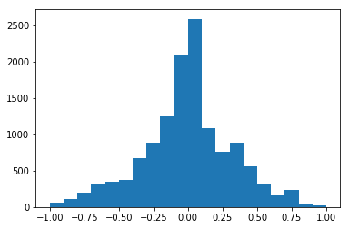
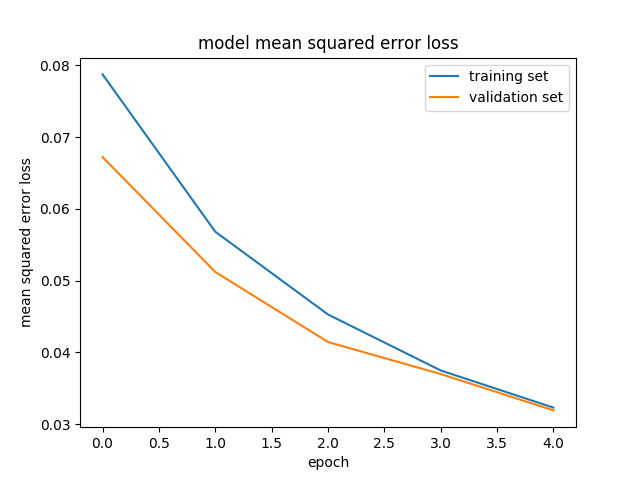

# Behavioral Cloning Project

## Overview
---
This repository contains necessary files for training and executing the Behavioral Cloning Project as well as the video outputs of the vehicle driving autonomously on both the tracks provided in the simulator by Udacity.

The goals / steps of this project are the following:
* Use the simulator to collect data of good driving behavior 
* Design, train and validate a model that predicts a steering angle from image data
* Use the model to drive the vehicle autonomously around the first track in the simulator. The vehicle should remain on the road for an entire loop around the track.
* Try the challenging track and see how it performs
* Summarize the results with a written report

## Necessary files for this project:
* **model.py** was used to build and train the model
* **drive.py** can me used to run the car in autonomous mode after launching the simulator
* **model_07.h5** is the file to be used with drive.py to drive the car in autonomous mode
    SYNTAX: python drive.py model_07.h5 <folder_name>
* **video.py** can be used to generate a video(.mp4) using the images collected during autonomous driving mode above
    SYNTAX: python video.py <folder_name>
* **run_7_track_1.mp4** is the video file for autonomous car driving on the first track
* **run_7_track_2.mp4** is the video file for autonomous car driving on the second challenging track 

## Developing the pipeline and using Keras to define the Convolution Nural Network

### Model Architecture
Initially I developed the keras CNN based on the CNN developed by NVIDIA which was introduced in one of the lessons and compiled the model using the example data provided by Udacity.

Below is the model architecture.

Layer | Shape 
----- | ----------- 
Original Image | 160 x 320 x 3
Crop Images to useful data | 90 x 320 x 3
Normalize image | 90 x 320 x 3
Convolutional 2D Layer 1 | 43 x 158 x 24
Convolutional 2D Layer 2 | 20 x 77 x 36
Dropout 30% data | 20 x 77 x 36
Convolutional 2D Layer 3 | 8 x 37 x 48
Convolutional 2D Layer 4 | 6 x 35 x 64
Convolutional 2D Layer 5 | 4 x 33 x 64
Drop out 30% data | 4 x 33 x 64
Flatten | 8448
Fully connected layer 1 | 100
Fully connected layer 2 | 50
Fully connected layer 3 | 10
Output | 1

It worked fine for one lap but once the vehicle went to the side, it didnt know how to bring it back to the center. So, once the vehicle was moving and my model was providing steering inputs, I collected data on both the tracks especially focusing on the following points:
* Keeping the car in the center of the track for the most part
* Intentionally taking the vehicle to the edge and then bringing the vehicle to the center so that the model can learn that
* Taking more time to steer in the challenging track when there was a big slope change along with the winding road

### Dropout Layers
I also added 2 dropout layers that would drop 30% data after Convolutional 2D layer 2 and layer 5 to prevent from overfitting the data.

### Data Augmentation
As the first track is biased towards driving the vehicle to the left hand side for the most part and has only 1 tight right hand curve, I took the following approach:
- Used all three camera images (left, center and right) to have 3 times the datasetto train my model. And added/subtracted 0.2 from the steering angle for left and right respectively so that vehicle can recover faster if it is getting pulled to either side of the track.

- Introduced fliplr() to randomly flip images and the corresponding steering angles. This way I didn't have to collect more data by driving the vehicle in the opposite direction as that would mean double the time recording the track as well as double compiling time for my model.

        

### Training Data Generator

While collecting the drive data to map the driving behavior, we end up collecting a lot of data (images) and preprocessing all of the data and making it available for the model compilation woudl require a lot of memory and processing time. Instead of storing the preprocessed data (images) in memory all at once, using a generator we can pull pieces of the data and process them on the fly only when we need them, which is much more memory-efficient. These pieces of data (batches) can be fed into the model and then a new batch can be preprocessed before the model needs it.

'Fit_generator' from keras was used to train the model using a python generator that passes data in batches of 32 images trained for 5 epochs. The output of the generator is an image and its correponding angle.

I used an Adam optimizer with its default learning rate.

### Randomly splitting the image data for better trained model
I used Keras train_test_split() function to split the data into training set(80%) and validation set (20%)

###  Steering wheel angle histogram
As we can see from the figure below, the training data collected has a steering wheel angle mean at 0 degrees. This was helpful to prevent the carfrom pulling in one direction while driving on a straight road.

X-axis = steering wheel input angle

Y-axis = number of sample

## Final trained model performance

I trained the model for 5 Epochs which gave me good results, without over
975/975 [==============================] - 413s 424ms/step - loss: 0.0787 - val_loss: 0.0672

Epoch 2/5

975/975 [==============================] - 411s 421ms/step - loss: 0.0568 - val_loss: 0.0512

Epoch 3/5

975/975 [==============================] - 410s 421ms/step - loss: 0.0453 - val_loss: 0.0414

Epoch 4/5

975/975 [==============================] - 409s 419ms/step - loss: 0.0375 - val_loss: 0.0370

Epoch 5/5

975/975 [==============================] - 402s 412ms/step - loss: 0.0323 - val_loss: 0.0319

